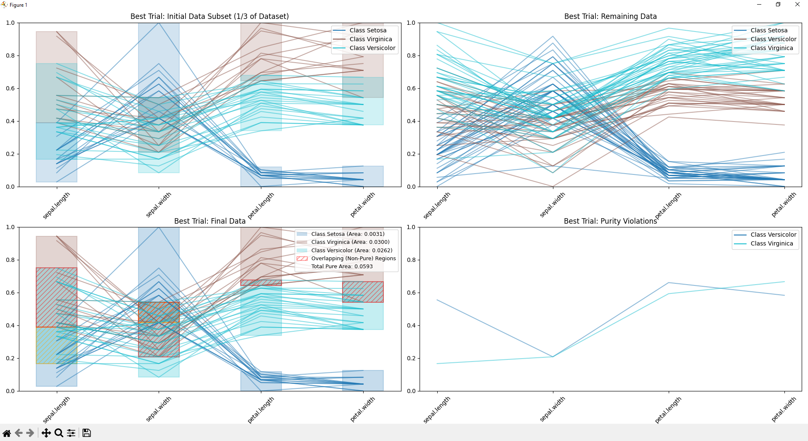

# Iterative_Subset_Hyperblock_Search

Finding representative hyperblocks by iterating on subsets of the training data for repeating patterns.

Video of picking up completely randomly 1/3 subsets of the Fisher Iris training data iteratively with replacement: <https://www.youtube.com/watch?v=HR7-bnE_b64>

Working demo of growing 1/3 subset until HB purity violation: 

## How to use

1. Clone the repository:

   ```bash
   git clone https://github.com/yourusername/Iterative_Subset_Hyperblock_Search.git
   cd Iterative_Subset_Hyperblock_Search
   ```

2. Install the required dependencies:

   ```bash
   pip install pandas numpy matplotlib scikit-learn tabulate
   ```

3. Run the main script:

   ```bash
   python direct.py
   ```

   - You'll be prompted to choose between generated Gaussian test data or loading from a file
   - If you select option 1, the program will generate synthetic Gaussian data with two classes
   - If you select option 2, a file dialog will open to select your CSV dataset
   - The program will analyze the data and generate hyperblocks using three algorithms: IHyper, MHyper, and IMHyper
   - Results will be displayed in the console and visualized in parallel coordinates

4. Generating Gaussian test data:
   - When you select option 1, the program will generate synthetic data with two classes
   - By default, it creates 100 samples with 2 features
   - Class 0 follows a Gaussian distribution with mean at origin and unit variance
   - Class 1 follows a Gaussian distribution with mean at (3,3) and 1.5 variance
   - The generated data will be visualized before hyperblock analysis

5. For dataset splitting:

   ```bash
   python data_splitter.py
   ```

   - This utility will help you create multiple train-test splits for cross-validation
   - By default, it creates 10 splits with 1/3 training and 2/3 testing data
   - Stratified sampling is used to maintain class distribution

## Dataset Preparation

Prepare your dataset with the following guidelines:

- The data should be in .CSV format
- One column should contain the class labels (by default, looks for a column named "class" case-insensitive or fallsback to using the last column)
- All other columns should be numeric features i.e. attributes

## References

This project is working with algorithms available in:

[1] Kovalerchuk B, Hayes D. Discovering interpretable machine learning models in parallel coordinates. In 2021 25th International conference information visualisation (IV) 2021 Jul 5 (pp. 181-188). IEEE.  
[2] Huber L, Kovalerchuk B, Recaido C. Visual knowledge discovery with general line coordinates. In Artificial Intelligence and Visualization: Advancing Visual Knowledge Discovery 2024 Apr 25 (pp. 159-202). Cham: Springer Nature Switzerland.  
[3] Huber, Lincoln, "Human-Centered Machine Learning with Interpretable Visual Knowledge Discovery" (2024). All Master's Theses.  

## License

This project is licensed for free and commercial use under the MIT License. See the [LICENSE](LICENSE) file for details.
